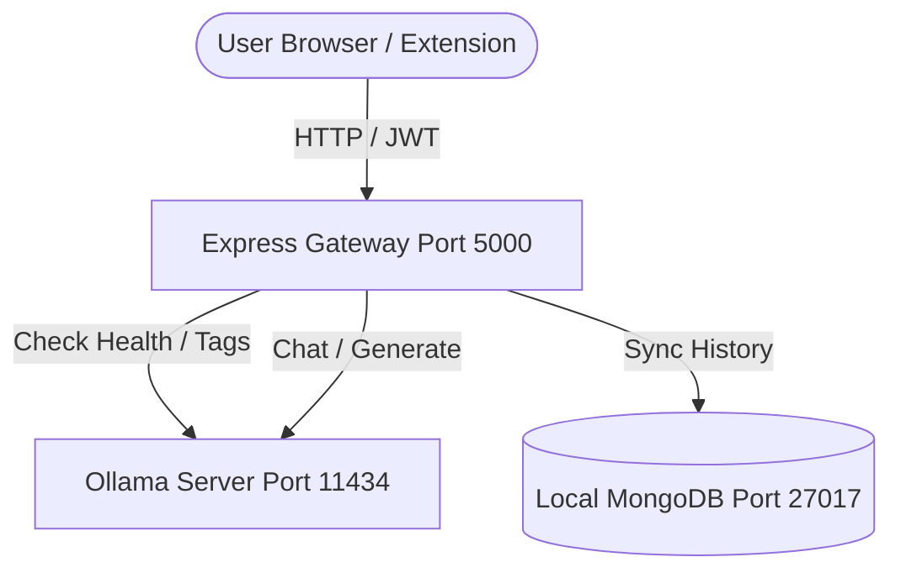

# JARVIS Local AI DevOps Control Center 🌐⚡


Welcome to the **JARVIS Local AI DevOps Control Center**! This branch is designed as a clean, local-first portfolio project demonstrating self-hosted local AI infrastructure, a DevOps/TechOps mindset, containerized services, built-in health checks, and zero dependency on external, paid AI APIs.

The entire cognitive pipeline runs locally using **Ollama** and the **Gemma 4** model via a Node.js Express backend proxy gateway.

---

## 🌟 Key DevOps & TechOps Features

- **Local AI Infrastructure**: All text-based chats, summaries, explanations, and copywriting reviews run locally via Ollama + Gemma 4.
- **Backend AI Gateway**: Eliminates client-side API keys. The frontend communicates only with the Express gateway, which proxies and controls requests to Ollama.
- **Docker-Ready Setup**: Orchestrated multi-container build using Docker Compose containing:
  - `mongodb`: High-reliability database service
  - `backend`: Express gateway with health telemetry
  - `frontend`: React (Vite) user dashboard
- **Linguistic Diagnostics (Health Checks)**: Pings `GET /api/health` to perform automatic reachability checks of the local Ollama instance and verifies if the target model is installed.
- **Observability**: Added clean, structured server logs for startups, chosen providers/models, health statuses, and failed requests.
- **Safe Fallbacks**: Audio modes are disabled cleanly with a system limitation message. Vision features return a clear error instead of crashing if the configured local model is not vision-capable.

---

## 🛠️ System Architecture



---

## 🚀 Quick Start Guide

### 1. Install & Configure Ollama
1. **Download Ollama**: Download and install [Ollama](https://ollama.com/) on your host machine.
2. **Pull the Model**: Pull the lightweight Google Gemma model using your terminal:
   ```bash
   ollama pull gemma4
   ```
3. **Start Ollama**: Make sure Ollama is running (typically runs in the background at `http://localhost:11434`).

### 2. Environment Configuration
Create or configure the `server/.env` file. It should contain:
```env
PORT=5000
JWT_SECRET=supersecretjarviskey1234
MONGO_URI=mongodb://127.0.0.1:27017/jarvis

# Local AI Configuration
AI_PROVIDER=ollama
OLLAMA_BASE_URL=http://localhost:11434
OLLAMA_MODEL=gemma4
```

### 3. Run the Project
You can build and start the entire stack (MongoDB, Backend, and Frontend) in one command:
```bash
docker compose up --build
```
- The **Frontend Dashboard** will be accessible at: `http://localhost:5173`
- The **Backend API** will be accessible at: `http://localhost:5000`
- The **MongoDB database** runs containerized on port `27017`

> [!NOTE]
> When running inside Docker, the backend resolves the host's Ollama instance using `http://host.docker.internal:11434`. This is automatically configured inside `docker-compose.yml` via the `extra_hosts` option.

---

## 📡 Observability & System Diagnostics

### Health Check Endpoint
To inspect the status of the local infrastructure, request:
`GET http://localhost:5000/api/health`

**Success Response (Ollama Connected and Model Present):**
```json
{
  "status": "ok",
  "service": "backend",
  "aiProvider": "ollama",
  "model": "gemma4",
  "ollama": "connected",
  "timestamp": "2026-05-28T07:00:00.000Z"
}
```

**Warning Response (Ollama Connected but Model Missing):**
```json
{
  "status": "warning",
  "service": "backend",
  "aiProvider": "ollama",
  "model": "gemma4",
  "ollama": "model_missing",
  "timestamp": "2026-05-28T07:01:00.000Z",
  "error": "Configured model 'gemma4' was not found. Run 'ollama pull gemma4' to install it."
}
```

---

## 🔒 Security & Data Compliance
- **No outbound data leaks**: All AI processing remains on your local hardware.
- **Token Protection**: Web-to-Extension communication utilizes short-lived JWT tokens passed inside custom headers.
- **BYOK Bypassed**: Private developer API keys are deprecated from the settings screen. No credit card or cloud-billing configurations are required to run this app.
